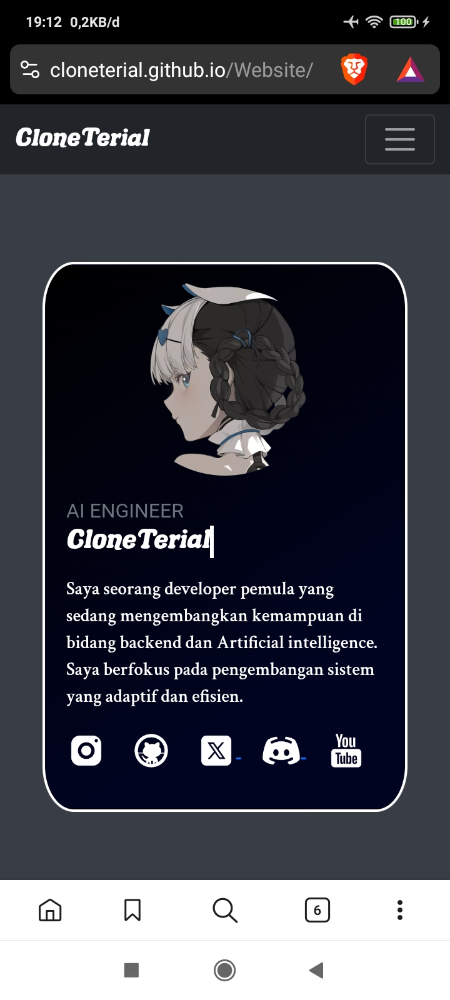

## 📱 Portfolio Web

Ini adalah proyek **portfolio web pribadi** yang dirancang mobile-first dan menampilkan informasi pengembang seperti proyek, skill, serta kontak. Dibangun menggunakan HTML, CSS, dan JavaScript vanilla, dengan dukungan Bootstrap & AOS animation.

### 🚀 Fitur Utama

- 🎨 Desain responsif dengan animasi menggunakan [AOS.js](https://michalsnik.github.io/aos/)
- 🎧 Gambar profil bisa memutar/mem-pause audio preview saat diklik
- 📱 Pop-up peringatan untuk pengguna desktop (optimal untuk mobile)
- 🎞️ Slider horizontal untuk menampilkan daftar proyek
- 🧠 skill dan teknologi yang digunakan
- 📌 Smooth scroll & navbar collapse otomatis

### 🛠️ Teknologi yang Digunakan

- **HTML5, CSS3, JavaScript**
- **Bootstrap 5**
- **AOS.js** – efek animasi scroll
- **jQuery** – smooth scroll
- **Custom Fonts** (Gecko & Altone)

### 🧪 Cara Menjalankan

1. Clone repositori:

   ```bash
   git clone https://github.com/CloneTerial/Website.git
   ```

2. Buka `index.html` di browser (disarankan mobile view atau mode developer).

### 📁 Struktur File

```
/
├── index.html        # Halaman utama portfolio
├── style.css         # Custom styling
├── script.js         # Interaktivitas audio, popup, dan event lainnya
├── song.MP3          # Audio preview (pastikan file ini ada)
├── pfp.jpg           # Gambar profil bundar
├── ...               # Gambar proyek & ikon sosial
```

### 📸 Preview

[see preview](https://cloneterial.github.io/Website/)


